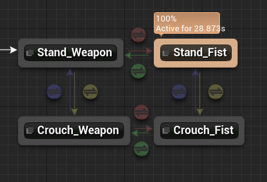

# TPS Game

基于UE4.27的第三人称多人射击游戏，采用服务器D/S服务器。

## 写在前面

由于一开始没有把网络同步考虑在项目之内，学习到这部分的时候发现整个项目都需要重构。

因此，**没有完整地实现此次任务**，项目没有打包，也没有做安卓的操作映射，未实现网络同步，未涉及的AI行为树。

但对于我学习了但未能实现（网络同步）的部分，还是写了一些自己的实现思路。

以及可改进的部分和实现思路。

最后，是我对一些游戏的**设计思路的思考**。

## 作业情况

### 任务书

### 要点拆解

1. 手机的按键映射，打包。
2. 能够打中靶子。靶子是能射线检测或碰撞检测的。
   * 实现方式1：玩家的枪械的射线检测，靶子相应响应动画。
   * 实现方式2：子弹做成`mesh`，使用**物理模拟**。
3. 通过使用`HUD`，并向`HUD`中添加 `widget`，根据操作隐藏或显示`widget` （`CreateWidget`， `AddToViewPoint`，`RemoveFromParent`）。
4. 击中靶子有击飞效果。靶子都是启用**物理模拟**的`mesh`，同时，需要为靶子开启**碰撞检测**给玩家计分。
5. 手雷的投掷，爆炸的范围击飞。需要为手雷向UE**注册碰撞响应函数**。
   * 伤害系统方面：手雷爆炸伤害使用 **`UGameplayStatics::ApplyRadialDamage`**添加径向伤害。
   * 物理效果方面：给手雷设置一个实体，一个物理碰撞半径。在爆炸时，碰撞检测函数中， 使用 `AddRadicalForce`模拟爆炸击飞效果。
6. 动作方面，实现了蹲走，跑动，跳跃，**八向移动**，**瞄准偏移（动画缓存骨骼分层）**。拳头和持枪、站立和蹲走的**动画机**。以及**死亡状态的Montage**。
7. 实现了特殊材质，使用**`Time`改变UV图**实现流光溢彩。枪上装手电筒（`Spot Light Component`, 开启阴影）。加入景深效果。
8. 网络支持上，本机DS多玩家对战（局域网联机）
   * 需要使用源代码构建版本，用于**搭建D/S服务器**。
   * 熟悉**多人网络编程**如：`Replicated`，RepNotify，RPC，`NetMulticast`的用法。
9. AI行为树。

### 实现介绍

#### 角色

类比UE组件式的实现，为角色设计了如下组件等。

* 武器系统组件
* 健康系统组件

#### **枪械系统**

##### 类和逻辑设计

* 继承体系：设计一个基类 `BaseWeapon`（含弹药，后备弹药等）,两个派生类 `RifleWeapon`， `LaunchWeapon`。
* 为每种枪械设计**缩略贴图**和**瞄准图标**。
* 武器连发：定时器的使用。
* 角色武器环：使用自定义的双向环形链表。使用鼠标滚轮换枪，下一把和上一把。
* 按下`X`收枪拿枪，动画状态机相应改变。

* 射击、换弹、弹药减少等逻辑由代码实现， 缩略图和瞄准由蓝图指定。换弹播放换弹`Montage`。

##### 逻辑展示

1. 射线检测

2. 投掷物碰撞检测，碰撞后添加径向伤害并销毁自身。

**健康系统**

* 向`OnTakeAnyDamage`注册生命值修改函数。
* 申明一个委托，用于角色死亡的通知，在死亡时广播，通知其他客户端。
* 逻辑由代码实现， 显示由蓝图读取。

#### UI

**开始界面**

**暂停界面（暂停widget）**

**用户游戏信息界面**：（根据持有的武器选取**不同武器对应**的**贴图和瞄准图标**）

**死亡widget**：死亡时可见。

#### 其他

1. 武器特殊材质（使用Time更改UVs图），加入手电筒Spot Light。

   

### 未实现部分

#### 1. 景深

任务应该指的是材质添加的景深吧。

参考资料：

1. [UE4景深后处理效果学习笔记（一）基本原理 - 知乎 (zhihu.com)](https://zhuanlan.zhihu.com/p/335669216)
2. [UE4景深后处理效果学习笔记（二）效果实现 - 知乎 (zhihu.com)](https://zhuanlan.zhihu.com/p/336007155)

还是场景摄像机的景深？

参考资料

1. [景深 | 虚幻引擎文档 (unrealengine.com)](https://docs.unrealengine.com/4.26/zh-CN/RenderingAndGraphics/PostProcessEffects/DepthOfField/)
2. [移动平台景深方法 | 虚幻引擎文档 (unrealengine.com)](https://docs.unrealengine.com/4.26/zh-CN/RenderingAndGraphics/PostProcessEffects/DepthOfField/MobileDOFMethods/)

#### 2. 网络同步

> 若项目可能需要多人游戏功能，则从项目开始阶段起，构建所有gameplay时都应将多人游戏功能考虑在内。若开发团队通常会在创建多人游戏时实施额外步骤，相较于单人游戏，构建gameplay的流程并不会耗时过久。长远来看，项目将便于整个团队进行调试和维护。同时，虚幻引擎中编写的多人游戏gameplay仍可在单人游戏中使用。
>
> 但是，重构无网络情况下编译的基本代码需要梳理整个项目，几乎所有gameplay都需要重新编写。届时，开发团队成员需重新学习可能早已熟悉的编程实操。同时，网速和稳定的相关技术瓶颈也会让你措手不及。
>
> 相较于初期规划，在项目后期引入网络功能会占用大量资源，且极为复杂。因此，除非确定项目无需多人游戏功能，否则应 *始终* 按多人游戏方向进行编程.

我的项目一开始没有考虑到网络方面，如官方文档所言，需要重构甚至推导重来。

时间限制，虽然来不及重构，但我也学习了这方面的内容。以下是我的**实现思路**。

##### 对于用户请求（RPC）

根据用户的输入设定相关的函数，并

* 指定该函数为`Server` 并为`Reliable`。让客户端调用，由服务器来执行，并保证不丢失。

如，发射器武器的开火，生成投掷物。从客户端请求，让服务器执行。不过，投掷物需要设为复制，并且投掷物碰撞后的伤害处理逻辑仅在服务端服务端执行。

##### 对于简单属性（Repliacted + RepNotify）

如生命值Health

* 在类中override `GetLifetimeReplicatedProps`函数来指明要复制的属性。
* 给属性添加`ReplicatedUsing=`说明并指定更新函数为`Rep_HealthUpdate`。实现该函数，函数内调用`OnHealthUpdate`。
* 实现`OnHealthUpdate`。服务端和客户端做不同处理。客户端作一些显示，如死亡时角色死亡动画播放。
* 类重写`TakeDamage`函数，在受到伤害时调用`SetHealth`函数。
* 实现`SetHealth`函数，判断 `GetLocalRole() == ROLE_Authority` 才执行。设置新的Health，并调用`OnHealthUpdate`。
* 服务器使用RepNotify通知客户端更新生命值。

运行流程为：

1. 受到伤害，调用`TakeDamage`函数。
2. 在`TakeDamage`中调用`SetHealth`。
3. 在`SetHealth`中，仅在服务器中更改`Health`，服务器并调用自身的`OnHealthUpdate`函数。
4. 由于`Health`设置为复制，客户端会接收到更改后的`Health`。这个过程就是RepNotify。此时，客户端会调用`ReplicatedUsing=`指定的函数。此处为`Rep_HealthUpdate`。
5. 在`Rep_HealthUpdate`中，客户端做一些显示处理。

关键步骤是，**只在服务器执行`SetHealth`**。修改`Health`后复制给客户端，**客户端执行响应函数**。

##### 对于外观效果（RPC + NetMulitcast）

如，贴图、粒子、动画等。

* 实现一个多播函数 `void MulticastRPCFunction();` 声明为 `UFUNCTION( NetMulticast )`，用于所有客户端更新外观。
* 实现一个服务器的请求函数`void ServerRPCFunction();`声明为 `UFUNCTION( Server, Reliable)`，该函数中调用 `MulticastRPCFunction()`。

执行流程为

1. 客户端调用 `void ServerRPCFunction()`，这个函数会在服务器执行。
2. 执行时，该函数内会调用 `void MulticastRPCFunction();`这是个多播函数，在服务器调用会在服务器和所有客户端上运行。
3. 服务器和所有客户端更新外观效果。

##### 一般情况

当然，以上都是只是一些特别情况。对于其他需要考虑实现的情形，需要根据实际情况选择函数的调用方和执行方（客户端还是服务器）。

一个大的准则是：服务器处理逻辑，客户端负责显示和处理用户输入请求。

* [属性复制 | 虚幻引擎文档 (unrealengine.com)](https://docs.unrealengine.com/4.26/zh-CN/InteractiveExperiences/Networking/Actors/Properties/)
* [RPC | 虚幻引擎文档 (unrealengine.com)](https://docs.unrealengine.com/4.26/zh-CN/InteractiveExperiences/Networking/Actors/RPCs/)

#### 3. AI

未涉及。

### 扩展部分

#### 动画

实现了蹲走，跑动，跳跃，**八向移动**，**瞄准偏移（动画缓存骨骼分层）**。拳头和持枪、站立和蹲走的**动画机**。以及**死亡状态的Montage**

* 八向移动 

  

  

  

* 瞄准偏移（动画缓存+骨骼分层）

  

  

  

* 蹲走和战力、持枪和持拳状态机（持枪都设置了瞄准偏移）

  

### 可改进部分

1. 武器射击时添加相应的贴画和粒子效果，如弹孔和爆炸的效果等。
2. 为角色的状态机和Montage进行完善，设计一套平滑的移动系统。
3. 实现靠近武器，按下指定键才能拾取。**实现思路**：给能够拾取的物品添加一个碰撞体积或者能够被射线检测。检测或碰撞到就通知蓝图显示控件。
4. 添加背包系统。
5. 添加任务系统 ，成就系统。主要设计模式为**观察者模式**，任务、成就系统为观察者，角色的行为为被观察者。

​	...

## 我的思考

### 关于枪械系统的设计

**枪械继承体系**

这个是一个简单的类的设计。

* 武器基类包含开火、弹药等枪械共有功能。
* 基类派生出子弹枪械和投掷枪械。

**角色对枪械的操控方式**

一开始是想做一个类似单机游戏里头的武器环的效果。那既然是武器环，就对应环状的数据结构。首先我用的`TArray`来模拟，发现逻辑实现起来不够清晰。转而自写了一个双向环形链表。有如下优点

* 切换上一把和下一把武器的代码逻辑清晰。
* 武器环中切换武器只需切换对应的指针即可。
* 在扩展方面，如果后续需要一些特殊模式，如不限制枪支拾数量。能够很快速地完成开发。

但是转念一想，游戏为了一定的合理性和操作简化，不太可能设置同时携带太多把枪支。

直接使用两个武器指针硬编码主副武器也有一定的优势，少占内存且实现简单。如果游戏后续需要扩展游戏模式，再重新开发对应的武器接口系统也未尝不可。

后续在学习设计模式的时候也验证了，对于基本不会改变的逻辑，没有必要花心思在灵活性上。"抽象和解耦让扩展代码更快更容易，但除非确信需要灵活性，否则不要在这上面浪费时间"。

### 设计模式的学习
> 当我们想象优雅的代码时，想的是**通用**的那一个： 只需要很少的逻辑就可以覆盖整个用况。

趁着学UE，也同时了解了些基本游戏模式：[messenger1th/Design-Pattern (github.com)](https://github.com/messenger1th/Design-Pattern)[messenger1th/Design-Pattern (github.com)](https://github.com/messenger1th/Design-Pattern)

* 单例模式
* 命令模式：在游戏内的应用之一是，可以让用户自定义按键对应的功能（虚函数的简单应用）。其二是，将输入与角色解耦，让AI角色可用同样的输入逻辑控制。
* 观察者模式：这个在游戏内应用应该算是很广泛了，
* 组件模式

等等。

### 关于系统设计

> 高内聚，低耦合。

回顾我玩过的游戏，我能想到的设计。

#### 英雄联盟

Moba游戏的地图设计是独立的，不像一些剧情游戏需要频繁切换关卡，对于不同游戏模式开发不同游戏关卡即可。因此，开发重点落在角色技能设计上。

总的思路是**采用组件模式解耦**，攻击组件，装备组件，buff组件，移动组件，技能组件等等。

1. 比如，塞拉斯这个英雄。大招是偷取其他英雄的大招，这说明英雄的技能是不适合直接编码到角色身上的。**将技能实现为组件**，角色使用技能指针来操作，将技能与角色的解耦（decouple）开，降低其依赖性，便于复用。这种设计比技能属于英雄是更为合理的。
2. 其次，对于角色的攻击。涉及攻击组件和装备属性**组件的通信**，一些有位移的攻击还涉及移动组件的通信。
3. 游戏击杀的显示如一血、三杀五杀等等。用到**观察者模式**，角色通知UI显示。

#### 孤岛惊魂

是一个第一人称动作射击游戏，含丰富的游戏内容。

* 丰富的移动系统：滑铲（快速移动时下蹲），翻墙等等，可能用到**状态模式**（有限状态机、分层状态机、分层状态机等）。
* 手感不错的潜入暗杀系统：需要对各种**组件的通信**充分打磨，应对复杂情况如：未被发现时能够暗杀，手雷暗杀、水下暗杀、手枪暗杀、近战武器暗杀等等。
* 有一定真实性的AI敌人：对于**AI**听取声音和实现需要不断调整，让玩家有良好的游戏体验。
* 任务系统和成就系统：主要用到**观察者模式**，观察玩家的完成情况。
* 剧情中含交互元素。剧情中UI，按键输入交互。

等等。

#### 巫师三

* 丰富的装备系统，攻击系统，特效显示，技能之间的衔接等。
* 背包系统。**碰撞检测**，选择是否拾取物品。
* AI Boss的设计。
* 成就系统，任务系统。主要用到**观察者模式**，观察玩家的完成情况。

等等。

## 总结

总的来说，这次学习是很有意思的。

我基本了解了游戏运行的逻辑和一些实现方式，也同时学习了相关的精妙设计模式。

我也能够有意识地回忆接触过的游戏中的设计，以及我自己实现的思考。尽管这可能不是最优解，但也足够有趣。

